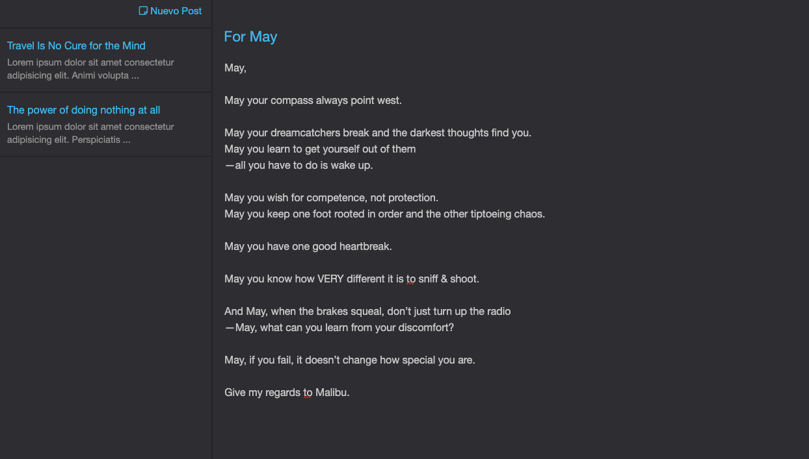

# ❄ Frozen-Island 🏝

App made with view engine Pug, NodeJs and MongoDB.

#### 🕹️ Demo https://frozen-island-95658.herokuapp.com/

## ✋ Before Getting Started You Should…

    1. Have some Pug knowledge.
    2. Have some Rest API  knowledge.
    3. Have some Node.js and Express knowledge.
    2. Have npm or yarn (or other package manager) set up on your computer.
    3. Have Node 8.10 or higher installed in computer.

## ⭐ Getting Started

These instructions will get you a copy of the project up and running on your local machine for development and testing purposes. 

### 👉 Clone the repository to your machine

#### 1. Copy the URL
    https://github.com/EfrenSanchez/Notes-Pug.git

#### 2. Term:
    $ git clone https://github.com/EfrenSanchez/Notes-Pug.git
    $ cd Notes-Pug

### 👉 Get the dependencies

Then, using your favorite package manager get the dependencies.

Example using npm:

    $ npm install

### 👉 Create .env

MONGO_URI= `<Url to your mongo database>`
COOKIE_SECRET= `<cookie-session's secret>`

### 👉 Available Scripts

In the project directory, you can run:

#### - Run server on developer mode (:4000 by default) 
    $ npm run dev
    http://localhost:4000/  

#### - Run server on dist mode:
    $ npm start

## 🏗️ Built With

- [Node.js](https://nodejs.org) - Backend language.
- [Express](https://expressjs.com/) - Web framework for Node.js.
- [Pug](https://pugjs.org/api/getting-started.html) - View engine.
- [Mongoose](https://mongoosejs.com/) -  Library for MongoDB

## 🖋️ Author

- **Efren Sanchez** - *Initial work* - [EfrenSanchez](https://github.com/EfrenSanchez)

## ©️ License

This project is licensed under the MIT License 

Open source software with source code that anyone can inspect, modify, and enhance.